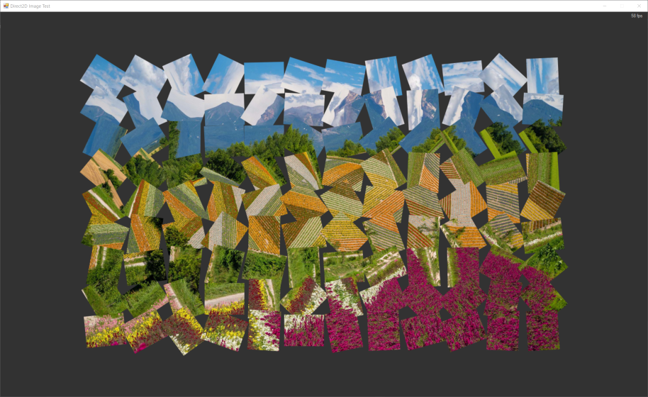

[](https://github.com/jingwood/d2dlib/blob/master/LICENSE.md) [](https://www.nuget.org/packages/unvell.D2DLib)

# d2dlib

A .NET library for hardware-accelerated, high performance, immediate mode rendering via Direct2D.

By using the graphics context to draw anything on windows form, control or draw in memory via Direct2D. The graphics interface is designed like the normal Windows Form graphics interface, it's easy-to-learn and user-friendly.

| Project | Language | Description | Output DLL | 
| --- | --- | --- | --- |
| d2dlib | VC++ | Wrapper host-side library, calling Windows SDK and Direct2D API | d2dlib.dll | 
| d2dlibexport | C# | Wrapper client-side library, export the interface provided from d2dlib | d2dlibexport.dll |
| d2dwinform | C# | Provides the `D2DWinForm` and `D2DControl` classes that use Direct2D hardware-acceleration graphics context during rendering | d2dwinform.dll |

# Installation

## Get binary from NuGet

```shell
install-package unvell.d2dlib
```

Or install for x64 platform:

```shell
install-package unvell.d2dlib-x64
```

## Notes

The Direct2D API is a platform-associated API that requires the application to be targeted to either x86 or x64 platform. To run the application uses this library correctly, the `Platform target` of the project settings must be set to `x86` or `x64`.

## Install manually

Learn how to [install manually](../../wiki/Manual-installation)

# Getting Started

1. Make windows form or control inherited from `D2DForm` or `D2DControl` class
2. Override `OnRender(D2DGraphics g)` method (do not override .NET `OnPaint` method)
3. Draw anything inside `OnRender` method via the `g` context

# Drawing

## Draw rectangle

```csharp
protected override void OnRender(D2DGraphics g)
{
  var rect = new D2DRect(0, 0, 10, 10);
  g.DrawRectangle(rect, D2DColor.Red);
}
```

## Draw ellipse

```csharp
var ellipse = new D2DEllipse(0, 0, 10, 10);
g.DrawEllipse(ellipse, D2DColor.Gray);
```

## Draw text

```csharp
g.DrawText("Hello World", D2DColor.Yellow, this.Font, 100, 200);
```

## Using brush object

### Solid color brush

```csharp
var brush = Device.CreateSolidColorBrush(new D2DColor(1, 0, 0.5));
g.DrawEllipse(rect, brush);
```

### Linear and radio gradient brush

```csharp
var brush = Device.CreateLinearGradientBrush(new D2DPoint(0, 0), new D2DPoint(200, 100),
  new D2DGradientStop[] {
    new D2DGradientStop(0, D2DColor.White),
    new D2DGradientStop(0.5, D2DColor.Green),
    new D2DGradientStop(1, D2DColor.Black),
  });
```

## Draw bitmap

```csharp
g.DrawBitmap(bmp, this.ClientRectangle);
```

### Convert GDI+ bitmap to Direct2D bitmap for getting high-performance rendering

```csharp
// convert to Direct2D bitmap
var d2dbmp = Device.CreateBitmapFromGDIBitmap(gdiBitmap);

// draw Direct2D bitmap
g.DrawBitmap(d2dbmp, this.ClientRectangle);
```

### Drawing on GDI+ bitmap

```csharp
// create and draw on GDI+ bitmap
var gdiBmp = new Bitmap(1024, 1024);
using (Graphics g = Graphics.FromImage(gdiBmp))
{
  g.DrawString("This is GDI+ bitmap layer", new Font(this.Font.FontFamily, 48), Brushes.Black, 10, 10);
}

// draw memory bitmap on screen
g.DrawBitmap(gdiBmp, this.ClientRectangle);
```

Learn more about [Bitmap](https://github.com/jingwood/d2dlib/wiki/Bitmap).
See [Example code](src/Examples/Demos/BitmapCustomDraw.cs)

### Drawing on Direct2D memory bitmap

```csharp
var bmpGraphics = this.Device.CreateBitmapGraphics(1024, 1024);
bmpGraphics.BeginRender();
bmpGraphics.FillRectangle(170, 790, 670, 80, new D2DColor(0.4f, D2DColor.Black));
bmpGraphics.DrawText("This is Direct2D device bitmap", D2DColor.Goldenrod, this.Font, 180, 800);
bmpGraphics.EndRender();

// draw this device bitmap on screen
g.DrawBitmap(bmpGraphics, this.ClientRectangle);
```

*Note:* When creating a Direct2D Device bitmap, do not forget call `BeginRender` and `EndRender` method.

## Using transform

By calling `PushTransform` and `PopTransform` to make a transform session.

```csharp
g.PushTransform();

// rotate 45 degree
g.RotateTransform(45, centerPoint);

g.DrawBitmap(mybmp, rect);
g.PopTransform();
```

# Examples

Fast images rendering

See [source code](src/Examples/Demos/ImageTest.cs)

Custom draw on memory bitmap

See [source code](src/Examples/Demos/BitmapCustomDraw.cs)

Star space simulation

See [source code](src/Examples/Demos/StarSpace.cs)

Subtitle rendering

See [source code](src/Examples/Demos/Subtitle.cs)

Whiteboard App
\
See [source code](src/Examples/Demos/Whiteboard.cs)
